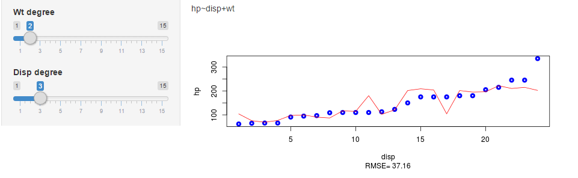
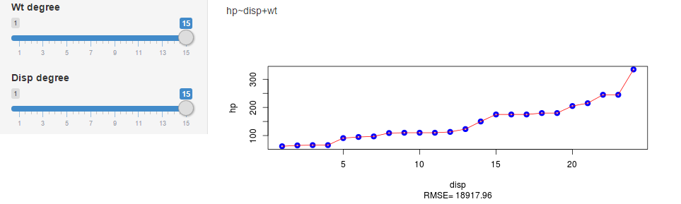

## About

The app is hosted here: https://denistsitko.shinyapps.io/ForFun

You can change the degrees of polynomials (P(wt) and P(disp)) and look how will RMSE on the test set change.

On the plots you can see linear models: hp=P(wt), hp=P(disp), hp=P(wt)+P(disp) on the training set (points are for hp and lines for predictions). Under the plots there are RMSE for that predictions on the test set.

This is an illustration of overfitting. You can see, that perfect fit on the training set could give you a realy huge RMSE on the test set.

--- 

## Small RMSE on test set == not ideal fit on training set

You can see, that small degrees gives pretty good RMSE on the test set, but fitting on training set is not perfect:

---

## Ideal fit on training set == huge RMSE on test set

You can see, that large degrees gives perfect fit on training set, by really large RMSE on test set:

