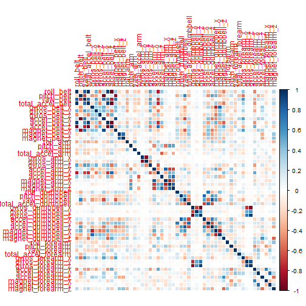
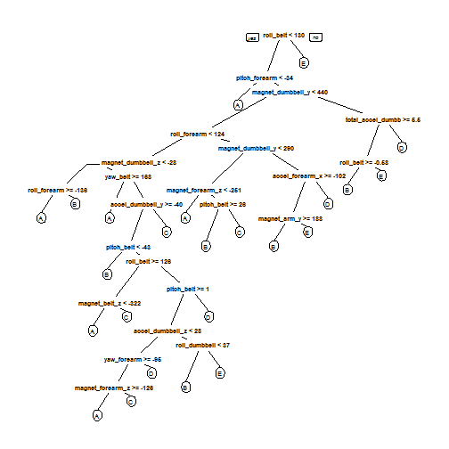

---
Practical Machine Learning Course Project by Denis Tsitko (18.05.2015)
---

---
Librarys
---


```r
library(rpart)
library(rpart.plot)
library(randomForest)
library(caret)
library(corrplot)
```


---
Downloading and reading data
---


```r
if (!file.exists("train.csv")) {
  download.file("https://d396qusza40orc.cloudfront.net/predmachlearn/pml-training.csv", destfile="train.csv")
}
if (!file.exists("test.csv")) {
  download.file("https://d396qusza40orc.cloudfront.net/predmachlearn/pml-testing.csv", destfile="test.csv")
}

train<-read.csv("train.csv")
test<-read.csv("test.csv")
```

---
Cleaning data
---

Lets look at the data dimentions:


```r
dim(train)
```

```
## [1] 19622   160
```

```r
dim(test)
```

```
## [1]  20 160
```

So there are 160 variables in each data set. And there is 19622 observations for training set and 20 oservations for test set.

Lets leave only variables with all complete cases:


```r
train <- train[, colSums(is.na(train)) == 0] 
test <- test[, colSums(is.na(test)) == 0] 
class <- train$classe
train2Rm <- grepl("^X|timestamp|window", names(train))
train <- train[, !train2Rm]
trainFin <- train[, sapply(train, is.numeric)]
trainFin$classe <- class
test2Rm <- grepl("^X|timestamp|window", names(test))
test <- test[, !test2Rm]
testFin <- test[, sapply(test, is.numeric)]
```

Lets look at the cleaned data dimentions:


```r
dim(trainFin)
```

```
## [1] 19622    53
```

```r
dim(testFin)
```

```
## [1] 20 53
```

So the nomber of observations are the same, but the number of variables for each set is now 53.

---
Creating preTrain and preTest sets
---


```r
set.seed(123) 
inTrain <- createDataPartition(trainFin$classe, p=0.60, list=F)
preTrain <- trainFin[inTrain, ]
preTest <- trainFin[-inTrain, ]
```

---
Creating the model
---

Here we will use a simple randomForest model training (using train from caret with defaults) for our data.


```r
set.seed(123)
trC <- trainControl(method="cv", 3)
md<-train(classe~.,data=preTrain, trControl=trC,ntree=200)
md
```

```
## Random Forest 
## 
## 11776 samples
##    52 predictor
##     5 classes: 'A', 'B', 'C', 'D', 'E' 
## 
## No pre-processing
## Resampling: Cross-Validated (3 fold) 
## 
## Summary of sample sizes: 7850, 7851, 7851 
## 
## Resampling results across tuning parameters:
## 
##   mtry  Accuracy   Kappa      Accuracy SD   Kappa SD    
##    2    0.9845448  0.9804493  0.0007787848  0.0009827493
##   27    0.9853940  0.9815223  0.0006428307  0.0008124981
##   52    0.9780065  0.9721743  0.0041226232  0.0052172985
## 
## Accuracy was used to select the optimal model using  the largest value.
## The final value used for the model was mtry = 27.
```

Now we predicting for preTets set:


```r
res <- predict(md, preTest)
confusionMatrix(preTest$classe, res)
```

```
## Confusion Matrix and Statistics
## 
##           Reference
## Prediction    A    B    C    D    E
##          A 2228    4    0    0    0
##          B   12 1504    2    0    0
##          C    0   10 1345   13    0
##          D    0    0   18 1268    0
##          E    0    0    5    4 1433
## 
## Overall Statistics
##                                          
##                Accuracy : 0.9913         
##                  95% CI : (0.989, 0.9933)
##     No Information Rate : 0.2855         
##     P-Value [Acc > NIR] : < 2.2e-16      
##                                          
##                   Kappa : 0.989          
##  Mcnemar's Test P-Value : NA             
## 
## Statistics by Class:
## 
##                      Class: A Class: B Class: C Class: D Class: E
## Sensitivity            0.9946   0.9908   0.9818   0.9868   1.0000
## Specificity            0.9993   0.9978   0.9964   0.9973   0.9986
## Pos Pred Value         0.9982   0.9908   0.9832   0.9860   0.9938
## Neg Pred Value         0.9979   0.9978   0.9961   0.9974   1.0000
## Prevalence             0.2855   0.1935   0.1746   0.1638   0.1826
## Detection Rate         0.2840   0.1917   0.1714   0.1616   0.1826
## Detection Prevalence   0.2845   0.1935   0.1744   0.1639   0.1838
## Balanced Accuracy      0.9970   0.9943   0.9891   0.9920   0.9993
```


```r
accuracy <- postResample(res, preTest$classe)
accuracy
```

```
##  Accuracy     Kappa 
## 0.9913332 0.9890362
```

So we have accuracy of about 99%.

Lets now update our model with preTest data and make a prediction for our testFin data:


```r
md<-update(md,data=preTest)
prediction <- predict(md, testFin[, -length(testFin[1,])])
prediction
```

```
##  [1] B A B A A E D B A A B C B A E E A B B B
## Levels: A B C D E
```

---
Plots
---

Lets plot correlation matrix:


```r
corrMat <- cor(trainFin[, -length(trainFin[1,])])
corrplot(corrMat, method="color")
```

 

Lets plot decision tree:


```r
tree <- rpart(classe ~ ., data=trainFin, method="class")
prp(tree) 
```

 
