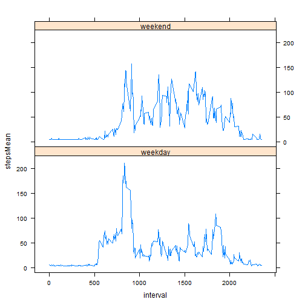

##Preamble

Lets load some libraries which we will use in uor research.

```r
library (plyr)
library (lattice)
```

##Loading and preprocessing the data

Assignment data set is included in activity.csv in this repository, it was taken from https://d396qusza40orc.cloudfront.net/repdata%2Fdata%2Factivity.zip on 13 april 2015. Lets load it:

```r
data <- read.csv ('activity.csv')
```
There is no need to transform the data

#What is mean total number of steps taken per day?

It is sums of steps for each day. Lets use plyr to find those sums:

```r
spd <- ddply (data,
              .(date), 
              summarize, 
              stepsSum=sum (steps, na.rm=TRUE))
```
Lets look at the results.


```r
hist (spd$stepsSum, breaks=13)
```

 

In summary we can see that steps per day have a mean of 9354 steps and median of 10395 steps per day:


```r
summary(spd)
```

```
##          date       stepsSum    
##  2012-10-01: 1   Min.   :    0  
##  2012-10-02: 1   1st Qu.: 6778  
##  2012-10-03: 1   Median :10395  
##  2012-10-04: 1   Mean   : 9354  
##  2012-10-05: 1   3rd Qu.:12811  
##  2012-10-06: 1   Max.   :21194  
##  (Other)   :55
```
#What is the average daily activity pattern?

Its a mean of steps per day. Lets find it:

```r
dap <- ddply (data,
              .(interval), 
              summarize, 
              stepsMean = mean(steps, na.rm=TRUE))
```
Lets look at it:

```r
plot (dap$interval, dap$stepsMean, type='l')
```

 


The busiest interval is 835.

##Imputing missing values


```r
which <- is.na (data$steps)
print(paste("Total missing=",sum(which)))
```

```
## [1] "Total missing= 2304"
```

```r
print(paste("% of all=",sum(which)*100/length(data$steps)))
```

```
## [1] "% of all= 13.1147540983607"
```
The data set comprises many missing step count values: a total of 2304, or 13.1147541 percent of the total.

What we are doung with missing values:
1. We replace an NA at interval i with the mean number of steps in that interval over the rest of the data set. 
2. For intervals which are NA over the entire series we impute the mean over all non-NA data.

```r
newData <- data
newData$steps[which] <-
  dap$stepsMean[dap$interval == newData$interval[which]]
newData$steps[is.na (newData$steps)] <- 
  mean (data$steps, na.rm=TRUE)
```
HereТs the histogram for changed data:

```r
newDataSpd <- ddply (newData,
                   .(date), 
                   summarize, 
                   stepsSum=sum (steps))
hist (newDataSpd$stepsSum,
      breaks=13)
```

 

The outliers at the low end have disapiered. Summary statistics also show this change in steps per day.

```r
summary(newDataSpd)
```

```
##          date       stepsSum    
##  2012-10-01: 1   Min.   :   41  
##  2012-10-02: 1   1st Qu.: 9819  
##  2012-10-03: 1   Median :10766  
##  2012-10-04: 1   Mean   :10766  
##  2012-10-05: 1   3rd Qu.:12811  
##  2012-10-06: 1   Max.   :21194  
##  (Other)   :55
```
The median and mean are now 10766.

#Are there differences in activity patterns between weekdays and weekends?

Lets separate weekdays and weekends.

```r
wd <- weekdays (as.Date (newData$date))
newData$dayTypes <- factor (wd,
                          levels <- c ('weekday', 'weekend'))
newData$dayTypes <- 'weekday'
newData$dayTypes[wd %in% c ('суббота', 'воскресенье')] <- 'weekend'
```
Computing and ploting the summaries:

```r
pad <- ddply (newData,
              .(interval, dayTypes), 
              summarize, 
              stepsMean = mean(steps, na.rm=TRUE))
xyplot (stepsMean ~ interval | dayTypes, 
        data=pad,
        type='l',
        layout=c (1, 2))
```

 


